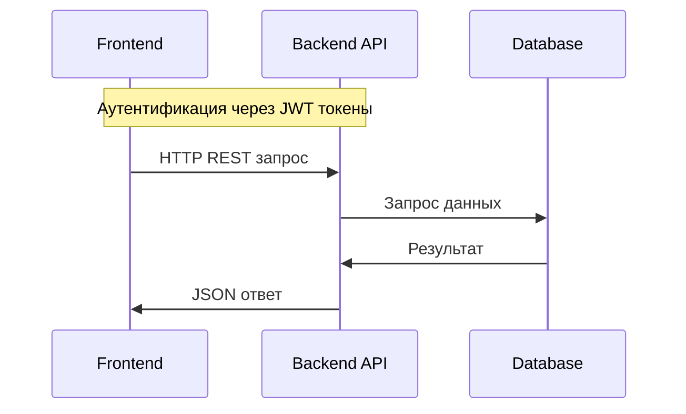
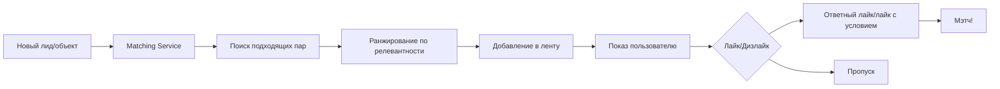
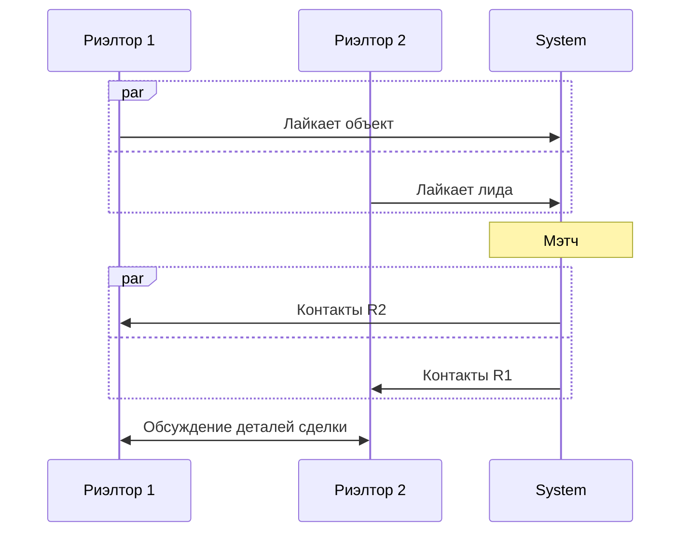
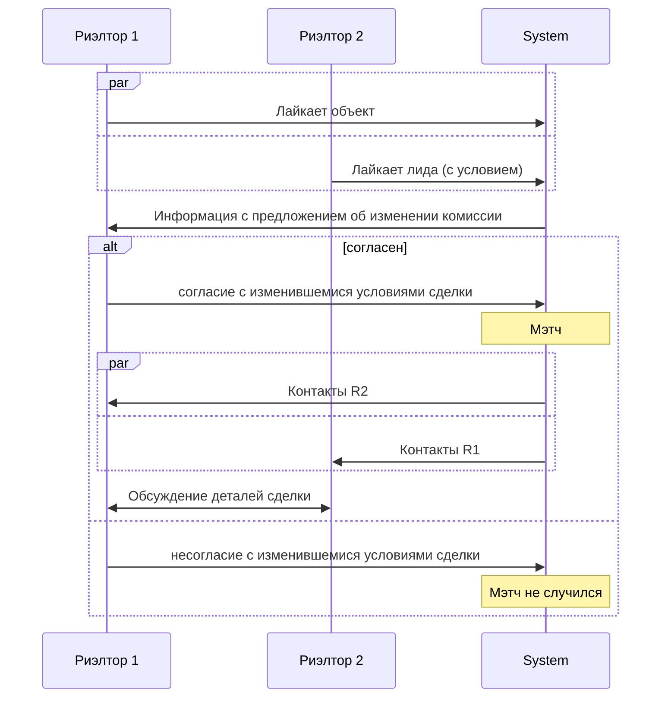
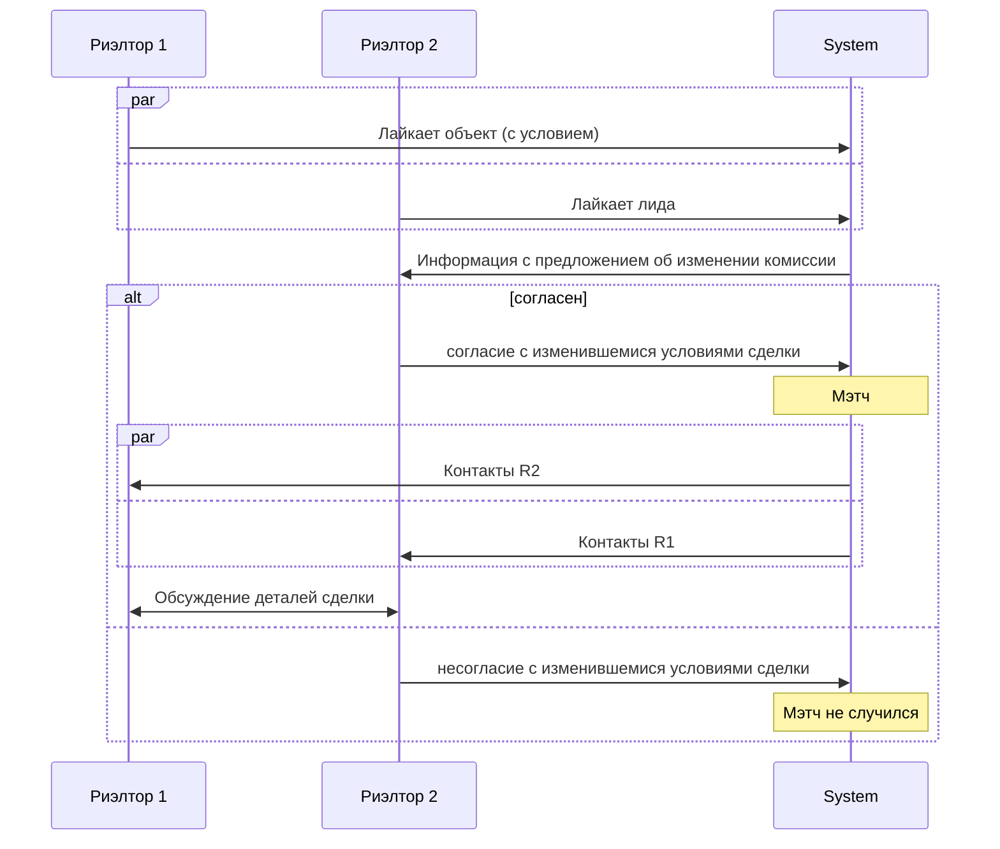
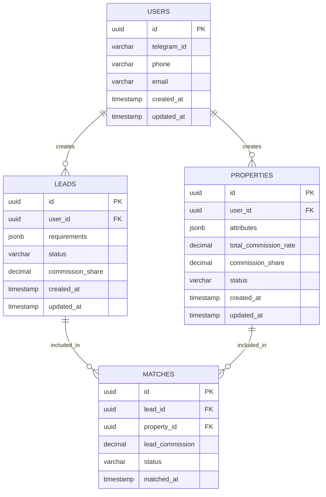

# Архитектура системы "Биржа лидов"

## Общее описание архитектуры

Система представляет собой веб-приложение с клиент-серверной архитектурой, ориентированное на мобильные устройства

## Основные компоненты системы

### 1. Клиентское приложение (Frontend)

- **Формат**: Мобильно-ориентированное веб-приложение (PWA) или Telegram Mini App
- **Технологии**: React + TypeScript
- **Основные функции**:
    - Интерфейс регистрации/авторизации
    - Управление лидами и объектами
    - Лента мэтчей (Tinder-like интерфейс)
    - Уведомления о мэтчах
    - Личный кабинет с базовой статистикой

### 2. Бэкенд сервисы (Backend)

- **Технологии**: Java с Spring Boot
- **Архитектура**: Монолит с четким разделением на модули

Рассмотрим основные модули

#### 2.1. User Service

- Регистрация и аутентификация пользователей
- Согласие с условиями платформы

#### 2.2. Lead Management Service

- CRUD операции для лидов (клиентов-покупателей)
- Валидация данных лидов
- Настройка долей комиссии
- Архивация/активация лидов

#### 2.3. Property Management Service

- CRUD операции для объектов недвижимости
- Валидация данных объектов
- Управление фотографиями объектов
- Настройка долей комиссии
- Архивация/активация объектов

#### 2.4. Matching Service

- Алгоритмы автоматического мэтчинга
- Управление лентой рекомендаций
- Обработка лайков/дизлайков
- Управление статусами мэтчей

#### 2.5. Notification Service

- Внутренние уведомления о мэтчах
- Управление push-уведомлениями (в интеграции с Telegram)

### 3. База данных

- **Технология**: PostgreSQL
- **Основные сущности**:
    - Пользователи (риэлторы)
    - Лиды (покупатели)
    - Объекты недвижимости
    - Мэтчи

## Формат взаимодействия между компонентами

### Взаимодействие Frontend <-> Backend

### Детальное описание ключевых процессов

#### Процесс мэтчинга

#### Процесс сделки после мэтча

##### При согласии с разделением комиссии

##### При несогласии с разделением комиссии

###### Со стороны лида

###### Со стороны объекта

## Технические решения

### API Design

- **RESTful API** с JSON форматом
- **Error Handling:** Стандартизированные HTTP коды ошибок

### База данных

## Масштабируемость и ограничения

### Текущие ограничения (MVP)

- До 1000 активных пользователей
- До 10000 активных лидов/объектов
- Простой алгоритм мэтчинга

### Возможности для масштабирования

- Кэширование частых запросов (Redis)
- Микросервисная архитектура
- Улучшенные алгоритмы мэтчинга (ML/DL)
- Горизонтальное масштабирование БД

