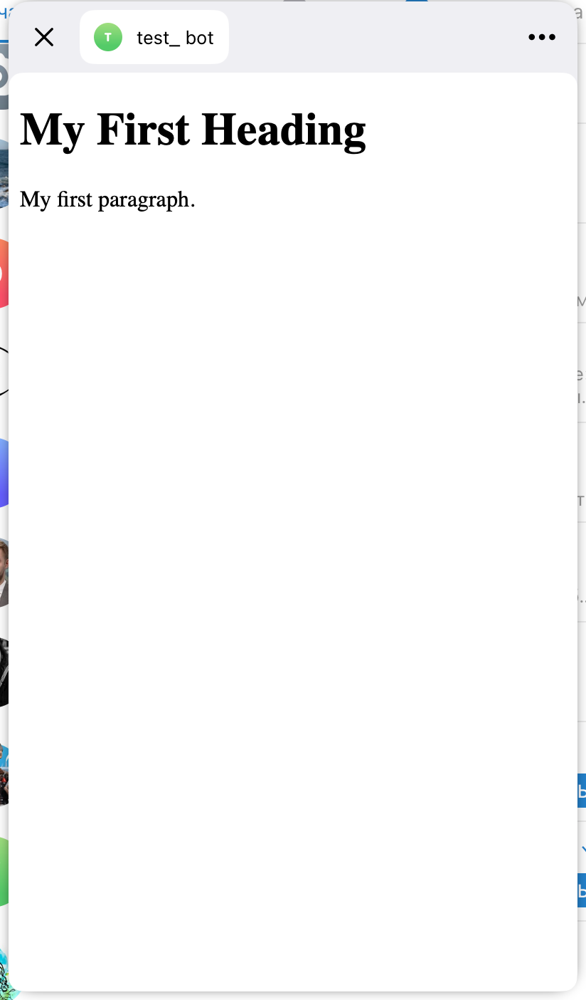

# Локальная сборка и тестирование

По сути есть 4 сущности:  
Двумя мы торчим наружу: **телеграмм-бот** и **тг мини-апп**.  
Телеграмм-бот получает команды напрямую от бекенда и работает для нас чем-то вроде сервиса для уведомлений пользователей.  
Тг мини-апп принимает на вход URL и перенаправляет пользователей по этому URL, передавая ещё некоторые параметры.

Далее URL, который мы дали тг мини-апп, ведёт на наш **front**, который общается с **бекендом**.  
Сервис команд тг-боту должен быть в том же контуре, что и остальной бек, чтобы знать, когда посылать уведомления.

---

## CI/CD, выкладывание на тест и прод

Создаём тг-бота, тг мини-апп, фронт и бек серваки — для прода и для теста.  
(В конфигах просто указываем нужные адреса, куда смотреть — тест фронт ходит на тест бек.)

---

### Где менеджить тг-сервисы

**@BotFather** (там настраиваются url-ы для переключения и тд)

## Локальное тестирование

### Бекенд:
- Бек тестируется через unit-тесты и ручное тестирование, например, через Postman.  
- Нужны ли нам end-to-end тесты — **нет**.  
- Локальное тестирование телеграмм-бота: вызывать апишку Телеграма можно откуда угодно, вопрос в том, что Телеграм не сможет отсылать ответы обратно на локальный http-сервер (нам эти ответы и не нужны).  
  Если нужно двухстороннее взаимодействие — настраиваем **ngrok** или **polling**.

### Фронтенд:
- Локально развёртываем с обращением к тест/прод бекенду.  
- Чтобы локально развернуть мини-апп, нужно использовать утилиту **ngrok**, которая переправит локальный http-сервер на https  
  (Телеграм не принимает http, ngrok создаёт что-то вроде реверс-прокси-туннеля http → https).  
- Необходимость тестировать локальный фронтенд вместе с локально развернутым бекендом вряд ли возникнет, но если возникнет,  
  то нужно будет просто перенаправить запросы к бекенду на локальный сервер.

---

## Пример выбора сервера бекенда

```typescript
export function getEnvName(): HostEnv {
    if (isServerRendering) {
        return 'prod';
    }

    if (isDev) {
        return 'http://127.0.0.1:5005';
    } else if (isTest) {
        return 'https://leadsProject.test';
    } else {
        return 'https://leadsProject.test';
    }
}
```

## Инструкция по ngrok

```bash
brew install ngrok

ngrok config add-authtoken *** 
// add auth-token - get it after auth at https://dashboard.ngrok.com/signup

// далее подключать с включенным vpn
ngrok http 5500
// вставить номер порта для локального сервака, в высветившемся окне дождаться connecting-сессии, взять https-url из поля forwarding, вставить в тг-мини-апп
```


